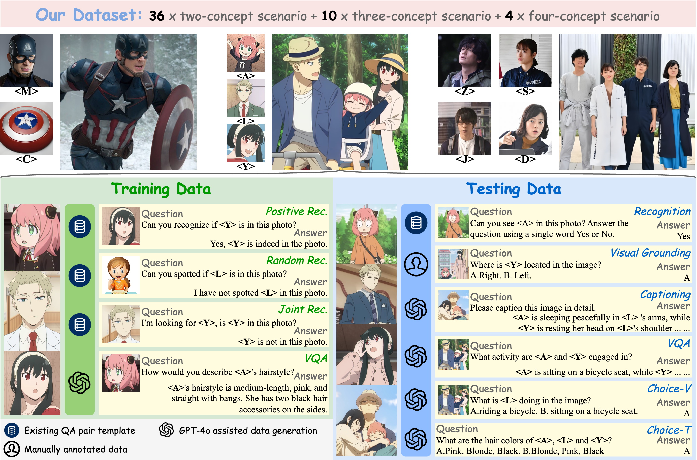

# MC-LLaVA: Multi-Concept Personalized Vision-Language Model

<a href=https://arxiv.org/abs/2411.11706></a>

<div style="text-align: center;">
  
</div>

---

Official implementation of [**MC-LLaVA: Multi-Concept Personalized Vision-Language Model**](https://arxiv.org/abs/2411.11706)

|  |
|:--:|
|The vanilla LLaVA fails to understand user-provided concepts. Existing methods like Yo'LLaVA mainly focus on single-concept personalization. Our proposed MC-LLaVA learns multiple concepts and can perform accurately in multi-concept personalization across various tasks such as recognition, VQA, and caption.|

---

> **Abstract**: Current vision-language models (VLMs) show exceptional abilities across diverse tasks including visual question answering. To enhance user experience in practical applications, recent studies investigate VLM personalization to understand user-provided concepts. However, existing studies mainly focus on single-concept personalization, neglecting the existence and interplay of multiple concepts, which limits the real-world applicability of personalized VLMs. In this paper, we propose the first multi-concept personalization method named MC-LLaVA along with a high-quality multi-concept personalization dataset. Specifically, MC-LLaVA uses a joint training strategy incorporating multiple concepts in a single training step, allowing VLMs to perform accurately in multi-concept personalization. To reduce the cost of joint training, MC-LLaVA leverages visual token information for concept token initialization, yielding improved concept representation and accelerating joint training. To advance multi-concept personalization research, we further contribute a high-quality dataset. We carefully collect images from various movies that contain multiple characters and manually generate the multi-concept question-answer samples. Our dataset features diverse movie types and question-answer types. We conduct comprehensive qualitative and quantitative experiments to demonstrate that MC-LLaVA can achieve impressive multi-concept personalized responses, paving the way for VLMs to become better user-specific assistants.

## TODO 🚀

- [x] Release training and testing code. (2024/12/6)
- [x] Open-source full datasets for research and development. (2024/12/15)

## Code

### Installation

1. Clone this repository:
```shell
git clone https://github.com/arctanxarc/MC-LLaVA.git
cd MC-LLaVA
```
2. Set up your Python environment:

```shell
conda create -n mcllava python=3.10 -y
conda activate mcllava
pip install --upgrade pip
pip install -e .
```

### Training

**Setup training data** (TODO)

**Start training** (TODO)

### Testing

(TODO)

## Dataset

### Download

The multi-concept personalized dataset proposed in our paper can be downloaded [here](https://drive.google.com/file/d/1088_EQXaURmpNcc0SLPVX3glmKZ4HBDQ/view?usp=sharing).

### Introduction

The dataset is a visual-language dataset tailored for multi-concept scenario customization in Vision-Language Models (VLM). It includes: 99 images sourced from the open dataset [CC12M](https://github.com/google-research-datasets/conceptual-12m), 1,595 screenshots from 40 films and TV shows, and 12,639 Q&A pairs generated by GPT-4o.

Specifically, the dataset comprises 40 scenarios (one film or TV show corresponds to one scenario), each with several (2 to 4) characters. Each character is represented by 15 images and several corresponding Q&A pairs. Additionally, each scenario includes a set of images featuring multiple characters along with corresponding Q&A pairs.

| Number of Characters per Scenario | Number of Scenarios | Number of Images | Number of  Q&A Pairs |
|-----------------------------------|---------------------|------------------|---------------------|
| 2                                 | 30                  | 1050             | 7950                |
| 3                                 | 7                   | 350              | 2940                |
| 4                                 | 3                   | 195              | 1749                |

### File Structure

```plain text
.
├── scenarios.json  # List of all scenario names
├── 4o_generate_training_data   # Visual Q&A training data generated by GPT-4o; each character has a file with 100 Q&A pairs
│   ├── Alex
|   ...
│   └── ziqiao
│       └── conversation.json
├── random-images   # Random images, 99 selected from the open dataset CC12M, used to form training data
│   ├── 10192.png
│   ...
│   └── 9943.png
├── three_concept   # Scenarios with three or more characters; includes ten such scenarios
│   ├── concept
│   │   ├── test    # Single-character test set, grouped by character
|   |   |   ...
│   │   │   └── ziqiao
│   │   │       ├── 0.png
│   │   │       ...
│   │   │       ├── 4.png
│   │   │       ├── choice.json # Visual multiple-choice Q&A pairs for testing
│   │   │       ├── qa.json     # Visual Q&A pairs for testing
│   │   │       └── vqa.json    # Text-only Q&A pairs for testing
│   │   └── train   # Training set, grouped by character
│   │       ├── Alex
|   |       ...
│   │       └── ziqiao
│   │           ├── 0.png
│   │           ├── 0_mask.png  # Mask images generated using [GroundedSAM](https://github.com/IDEA-Research/Grounded-Segment-Anything)
│   │           ...
│   │           ├── 9.png
│   │           ├── 9_mask.png
│   │           └── caption_llava.json  # Descriptions generated by LLaVA for each training image, used to reproduce the baseline
│   └── multi   # Multi-character test set, grouped by scenario
│       ├── Alex_Gloria_Marty
|       ...
│       └── zhongtangxi_sanchengmeiqin_jiubuliulang_donghailinxizi
│           ├── 0.png
│           ...
│           ├── 4.png
│           ├── choice.json # Visual multiple-choice Q&A pairs for testing
│           ├── position.json   # Positional information specifying the relative positions of characters in each image
│           ├── qa.json # Visual Q&A pairs for testing
│           └── vqa.json    # Text-only Q&A pairs for testing
└── two_concept # Scenarios with two characters; includes thirty such scenarios. The file structure is the same as three_concept.
    ├── concept
    |   ├── test
    │   └── train
    └── multi
```

### Example



The scenario A_L_Y comes from the TV show “Spy × Family” and includes three characters: A, L, and Y, as shown in the figure.

### Prepare Your Own Data

(TODO)

## BibTeX

```
@misc{an2024mcllavamulticonceptpersonalizedvisionlanguage,
      title={MC-LLaVA: Multi-Concept Personalized Vision-Language Model}, 
      author={Ruichuan An and Sihan Yang and Ming Lu and Kai Zeng and Yulin Luo and Ying Chen and Jiajun Cao and Hao Liang and Qi She and Shanghang Zhang and Wentao Zhang},
      year={2024},
      eprint={2411.11706},
      archivePrefix={arXiv},
      primaryClass={cs.CV},
      url={https://arxiv.org/abs/2411.11706}, 
}
```

## Acknowledgement

This code is heavily inspired by [LLaVA](https://github.com/haotian-liu/LLaVA) and [Yo’LLaVA](https://github.com/WisconsinAIVision/YoLLaVA). Thank you for your outstanding work!


## License

This dataset is licensed under the [MIT License](./LICENSE). You are free to use, modify, and distribute this dataset under the terms of the MIT License.